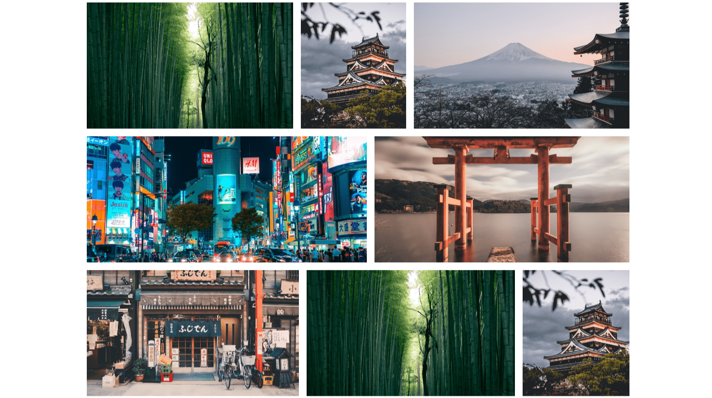

<div align="center">
    <a href="https://responsive-gallery-fv.netlify.app" target="_blank">
      
    </a>
  <h3 align="center">Responsive Gallery - Flexbox</h3>
</div>

##  <br /> 📋 <a name="table">Table of Contents</a>

- ✨ [Introduction](#introduction)
- ⚙️ [Tech Stack](#tech-stack)
- 🚀 [Quick Start](#quick-start)

##  <br /> <a name="introduction">✨ Introduction</a>

**[EN]** Responsive gallery designed with Flexbox, featuring a modern aesthetic and seamless layout adjustments across various devices. Built using HTML, CSS, this gallery offers an intuitive and visually appealing way to showcase images.

**[FR]** Galerie responsive conçue avec Flexbox, arborant une esthétique moderne et un agencement fluide sur tout type d'appareil. Réalisée en HTML et CSS, cette galerie offre un moyen intuitif et visuellement attrayant pour présenter des images.

##  <br /> <a name="tech-stack">⚙️ Tech Stack</a>

- **HTML** (HyperText Markup Language) is the standard markup language used to create and structure content on the web. It provides the basic building blocks for web pages, defining elements such as headings, paragraphs, images, links, and more. HTML forms the backbone of any web document and is essential for web development.
  
- **CSS** (Cascading Style Sheets) is a stylesheet language used to control the presentation and layout of web pages. It allows developers to apply styles such as colors, fonts, spacing, and positioning to HTML elements. CSS enhances the visual appeal and user experience of a website by enabling the separation of content and design.
  
- **Flexbox** (Flexible Box Layout) is a layout module in CSS designed for arranging and aligning items within a container. It simplifies the process of creating responsive and flexible layouts by providing a set of properties that allow for dynamic resizing, reordering, and alignment of elements. Flexbox ensures that elements within a container adapt smoothly to different screen sizes and orientations, making it ideal for building modern, flexible web designs.

- **Responsive Design** refers to a web design approach that ensures a website or application adapts smoothly to different screen sizes and device types. It uses flexible grid layouts, images, and media queries in CSS to create a seamless user experience across various devices, from desktop monitors to mobile phones. Responsive design aims to provide optimal viewing and interaction by adjusting content layout, scaling elements, and adjusting navigation based on the device's screen size and orientation.

- **Media Queries** are a feature of CSS that allows developers to apply different styles to a webpage based on the characteristics of the device or viewport, such as screen size, resolution, or orientation. By using media queries, developers can create responsive designs that adapt to various devices and screen sizes, ensuring a consistent and optimized user experience across desktops, tablets, and mobile phones. Media queries enable conditional CSS rules, helping to tailor the presentation of content to fit the context in which it is viewed.

## <br /> <a name="quick-start">🚀 Quick Start</a>

Follow these steps to set up the project locally on your machine.

<br/>**Prerequisites**

Make sure you have the following installed on your machine:

- [Git](https://git-scm.com/)
- [Node.js](https://nodejs.org/en)
- [npm](https://www.npmjs.com/) (Node Package Manager)

<br/>**Cloning the Repository**

```bash
git clone {git remote URL}
```

<br/>**Running the Project**

Use [Live Server](https://marketplace.visualstudio.com/items?itemName=ritwickdey.LiveServer)
to launch a development local server with live reload feature for static & dynamic pages.****